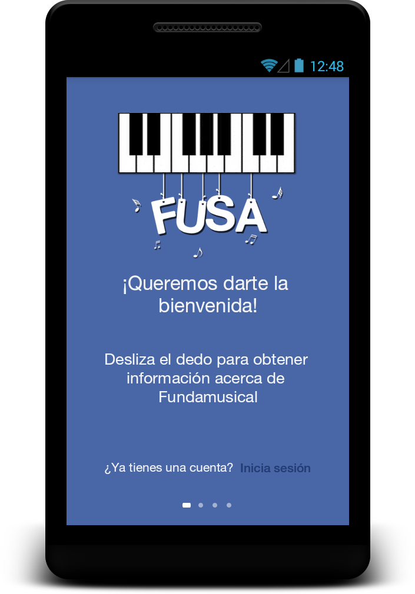

Fusa Android
=============

Click to image for see video.

Fusa es una aplicación para la gestión de un estudiante que pertenezca a la Fundación Simón Bolívar. Un estudiante puede estar informado de las noticias más relevantes de la fundación, ver sus horarios de clases, sus notas, ver los eventos por efectuarse y ya realizados, comentar en los que ya se realizaron, solicitar el préstamo de un instrumento, ver el estatus del instrumento, postularse o postular a un amigo, cambiar su contraseña y foto de perfil.

Esta aplicación fue realizada por motivo de asignación por parte de la asignatura Sistemas de Información de la Universidad Centroccidental Lisandro Alvarado (UCLA) como proyecto de grado para la ultima carga académica, esta aplicación junto a su aplicación web, serán para la Fundación.

Aquí les enseño la aplicación terminada por cuestiones de tiempo, realizado por mi persona, para que conozcan las funcionalidades implementadas en su desarrollo. Funciona solo para Android 4.2 o superior, no tiene soporte para tableta, ni teléfonos de baja resolución.

Para los servicios Rest, esta realizado bajo Spring, realizo por otras personas, la librería de consumo de servicios, también es de Spring junto a un mapeo por parte de Jackson. Esta adaptado bajo la arquitectura de diseño de Material Design, se usaron varias librerías de diseño de terceros, el diseño original es de una librería personal.

---------------------------

FUSA is an application for the management of a student belonging to the Fundación Simón Bolívar. A student can be informed of the most relevant news of the Foundation, see their schedules of classes, notes, events occur, and already carried out, comment in those who already were applying for the loan of an instrument, see the status of the instrument, apply or apply to a friend, change your password and profile picture.

This application was made by reason of allocations from the subject systems of information of the Universidad Centroccidental Lisandro Alvarado (UCLA) as a graduation project for last academic load, this application along with your web application, they will be for the Foundation.

Here I teach the application terminated for reasons of time, done by myself, to get to know the features implemented in its development. It works only for Android 4.2 or higher, it does not support tablet, or low resolution phones.

For Rest services, this carried out under Spring, performed by other people, the consumption of services library, also is spring along with a mapping from Jackson. This adapted under the design of Material Design architecture, several design of third-party libraries were used, the original design is a personal library.

Desarrollado por
============

* Juan Labrador - <juanjavierlabrador@gmail.com>

Colaboraciones
===============

* Silvana Dorantes - <silvanadorantes767@gmail.com>
(Implemento la mayoria de los servicios utilizados en Spring.)

* Josif Monroy - <josemonjean@gmail.com>
(Diseño del icono de launcher y otras imagenes usadas.)
